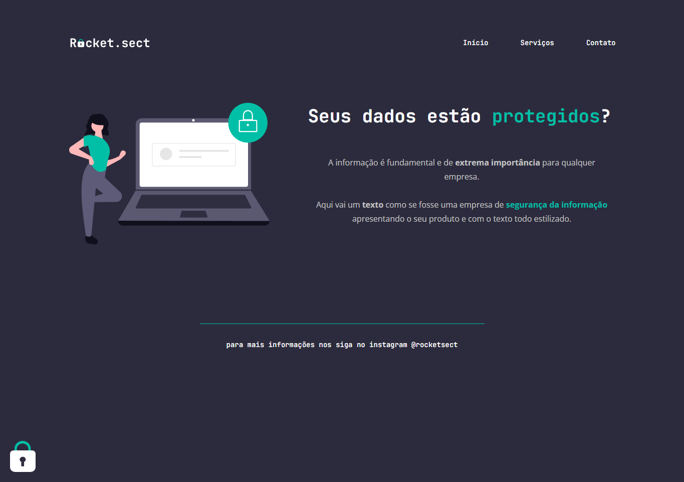

# Curso Explorer Rocketseat

Desafio avançado - Recriando layout Stage 2.

- Atráves do figma da aplicação, o desafio consiste em recriar a aplicação com tudo o que foi aprendido até agora no curso.

[🔗 Clique aqui para acessar]

## 🛠️ Tecnologias

- HTML
- CSS
